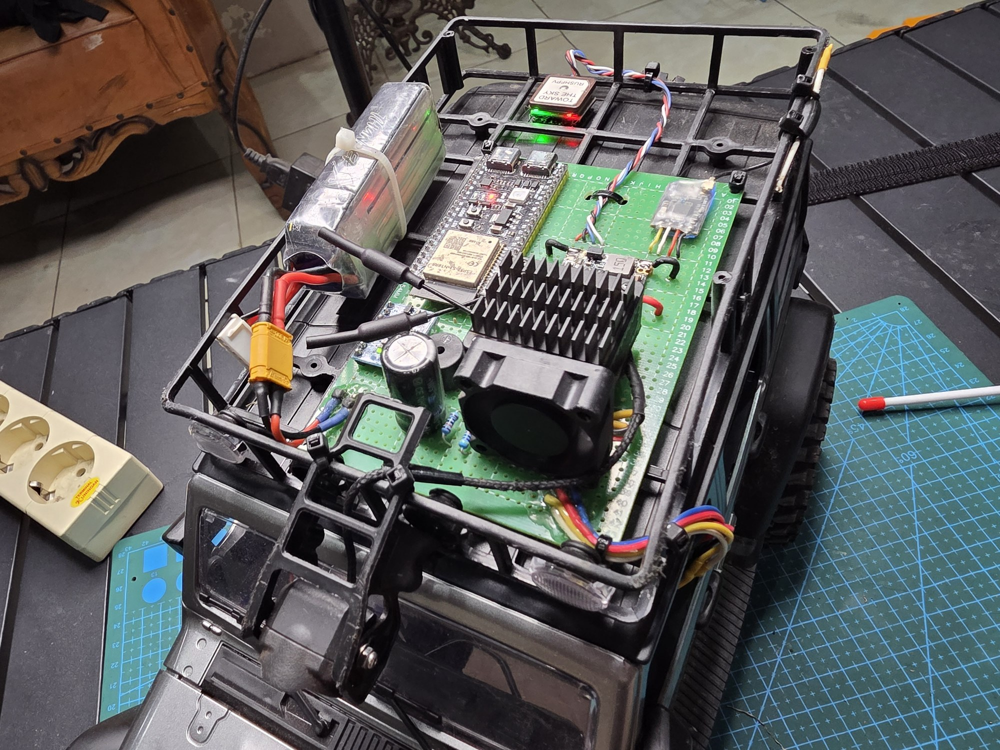
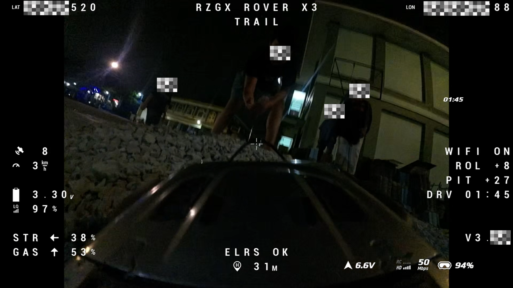

# RZGX Rover Controller

Experimental ESP32-based surface controller for RC adventure/trailing vehicles with ELRS input, PWM output, GPS telemetry, battery monitoring, IMU data, WiFi configuration, and DJI MSP DisplayPort OSD.

> Current public baseline target: **Stable 05 / firmware v3.30**  
> Project status: **experimental alpha / stable prototype**  
> This is not a Betaflight or INAV flight controller. It is a custom surface vehicle controller.

## Prototype

## What It Does

RZGX Rover Controller turns an ESP32-S3 into a small control and telemetry bridge for an RC ground vehicle.

Core responsibilities:

- Read ELRS CRSF receiver input.
- Output steering PWM and ESC PWM.
- Gate ESC/throttle output behind arming and safety checks.
- Read GPS NMEA data.
- Read RC battery voltage through an ADC voltage divider.
- Read MPU6050 IMU roll/pitch data.
- Reply to DJI O3/O4 MSP polling.
- Render a custom MSP DisplayPort OSD in DJI Goggles.
- Host a WiFi configurator for field setup.

The project is intended for manual FPV RC adventure, trailing, and light crawler-style vehicles.

## Main Features

- DJI O3/O4 MSP DisplayPort OSD.
- ELRS CRSF input.
- Steering PWM output.
- ESC PWM output with arming gate.
- ELRS failsafe handling.
- `TRAIL` / `CRAWL` drive mode.
- GPS coordinates, satellite count, speed, and home distance.
- Configurable home point acquisition:
  - minimum satellites,
  - stability delay.
- Manual home point reset gesture.
- RC battery voltage reading from ESP32 ADC.
- Low battery warning and fuel-empty throttle lock.
- Link quality display.
- STR and GAS percentage display.
- MPU6050 roll/pitch telemetry.
- Drive timer.
- Optional OSD visibility settings.
- WiFi configurator.

## Hardware Used In The Prototype

- ESP32-S3 DevKit.
- DJI O4 Pro Air Unit and DJI O3 Air Unit for testing.
- DJI Goggles 3.
- ELRS serial receiver.
- RadioMaster Boxer ELRS transmitter.
- M10 GPS module.
- MPU6050 IMU module.
- RC car/crawler platform based on MN128 with its stock 2S Li-ion drive battery.
- ESP32 powered from the MN128 stock ESC 5V output into the ESP32 5V input header.
- 1000 uF electrolytic capacitor near the ESP32 5V/GND rail for reset/brownout reduction.
- External 12V BEC and cooling fan for DJI O3/O4, as used in the prototype.

## Pinout

Stable 05 baseline pinout:

| Function | ESP32 pin | Notes |
| --- | ---: | --- |
| DJI MSP RX | GPIO16 | ESP32 RX from DJI TX |
| DJI MSP TX | GPIO15 | ESP32 TX to DJI RX |
| GPS RX | GPIO18 | ESP32 RX from GPS TX |
| GPS TX | GPIO17 | Optional ESP32 TX to GPS RX |
| ELRS CRSF RX | GPIO4 | ESP32 RX from ELRS TX |
| ELRS CRSF TX | GPIO5 | Reserved for future telemetry |
| Steering PWM | GPIO13 | CH1 steering output |
| ESC PWM | GPIO14 | CH2 GAS output, arm-gated |
| Battery ADC | GPIO1 | MN128 2S battery via 100k/47k voltage divider |
| MPU6050 SDA | GPIO8 | I2C |
| MPU6050 SCL | GPIO9 | I2C |

Experimental branches may add extra outputs such as camera pan/tilt servos. Treat those as non-stable until field-tested.

## WiFi Configurator

Default WiFi AP:

- SSID: `RZGXRover`
- Password: `RZGXRover`
- URL: `http://10.10.4.1/`

The configurator can adjust core settings such as craft name, steering/ESC direction, trims, battery thresholds, GPS home point settings, IMU calibration, and OSD visibility.

Battery warnings are based on the GPIO1 ADC reading from the MN128 2S battery divider. `RETURN NOW` and `FUEL EMPTY` use configurable per-cell thresholds; `FUEL EMPTY` locks ESC output to neutral until reboot.

## Safety Notice

This project can move a real RC vehicle. Incorrect wiring or configuration can make the vehicle move unexpectedly.

Before testing:

- Lift the wheels or disconnect drive power.
- Confirm all grounds are common.
- Confirm ESC signal and servo signal pins are correct.
- Confirm voltage divider output never exceeds ESP32 GPIO voltage limits.
- Keep ESC/throttle output disabled until arming and neutral checks are understood.
- Do not test near people, animals, traffic, or fragile property.

Use at your own risk.

## Known Limitations

- This is not plug-and-play hardware.
- The prototype uses hand wiring/perfboard and requires careful physical build quality.
- GPS lock quality depends heavily on location, antenna placement, sky view, and RF noise.
- DJI O4 behavior may vary by unit condition; one tested O4 unit showed inconsistent MSP OSD behavior after prior crash damage.
- DJI O3 showed more consistent MSP OSD behavior in testing, but needs strong cooling.
- Home direction arrows were intentionally removed from the stable baseline because GPS alone does not provide reliable vehicle nose heading.
- Advanced features such as camera pan/tilt, winch output, gear shifting, and wheel-controller bridging are experimental or future work.

## Repository Layout

Important files and folders:

- `firmware/RZGX_Rover_Controller/RZGX_Rover_Controller.ino`  
  Main Arduino sketch.
- `docs/releases/STABLE-05.md`  
  Notes for the current stable baseline.
- `docs/FIRMWARE_NOTES.md`  
  Firmware behavior notes.
- `docs/HARDWARE_WIRING.md`  
  Wiring notes.
- `docs/CONFIGURATOR_GUIDE.md`  
  WiFi/local configurator guide.
- `docs/TROUBLESHOOTING.md`  
  Test and troubleshooting notes.
- `docs/ROADMAP.md`  
  Planned features and future ideas.

## Acknowledgements

Created and maintained by **Rizangg / RZGX**.

Special thanks to **Renaldy FPV / aldyduino** for early MSP/DisplayPort reference work, technical discussion, and practical FPV insight during the prototype stage. His public reference project, [aldyduino/ESP32MSPDisplayPort](https://github.com/aldyduino/ESP32MSPDisplayPort), demonstrated an ESP32-based MSP DisplayPort approach for DJI OSD and helped validate the feasibility of this project.

This project is also inspired by the Betaflight and INAV ecosystem, especially their MSP-compatible DJI OSD workflows, DisplayPort OSD behavior, and common telemetry concepts such as GPS, battery, link quality, arming state, and home information. RZGX Rover Controller is not a Betaflight or INAV fork, and it is not a flight controller; it is a custom ESP32 surface vehicle controller.

This project was developed with AI-assisted coding support from **OpenAI Codex / ChatGPT**. The AI assistance was used as an engineering tool for implementation, debugging, documentation drafting, and iteration support; project direction, hardware testing, and final decisions remain with the maintainer.

## License

This project is intended to be released as open source under **GNU General Public License v3.0**.

The project references public MSP/DisplayPort behavior from the FPV ecosystem, especially Betaflight-style DJI MSP polling and OSD behavior, but it is a custom ESP32 surface controller for RC ground vehicles.

---

# RZGX Rover Controller - Bahasa Indonesia

RZGX Rover Controller adalah proyek eksperimental berbasis ESP32 untuk kendaraan RC darat/adventure/trailing. Sistem ini menggabungkan input ELRS, output PWM, telemetry GPS, pembacaan voltase baterai, data IMU, konfigurasi melalui WiFi, dan OSD DJI MSP DisplayPort.

> Baseline publik saat ini: **Stable 05 / firmware v3.30**  
> Status proyek: **experimental alpha / stable prototype**  
> Ini bukan flight controller Betaflight atau INAV. Ini adalah surface controller custom untuk kendaraan RC darat.

## Prototype

## Fungsi Utama

ESP32-S3 bertindak sebagai pengendali dan sumber telemetry/OSD untuk kendaraan RC darat.

Tugas utamanya:

- Membaca input receiver ELRS CRSF.
- Mengeluarkan sinyal PWM untuk steering.
- Mengeluarkan sinyal PWM untuk ESC/gas.
- Mengunci output gas di belakang sistem arming dan safety check.
- Membaca data GPS NMEA.
- Membaca voltase baterai RC melalui voltage divider ke ADC ESP32.
- Membaca data roll/pitch dari MPU6050.
- Membalas polling MSP dari DJI O3/O4.
- Menggambar OSD custom di DJI Goggles melalui MSP DisplayPort.
- Menyediakan WiFi configurator untuk pengaturan di lapangan.

Project ini ditujukan untuk penggunaan manual FPV RC adventure, trailing, dan crawler ringan.

## Fitur

- OSD DJI O3/O4 via MSP DisplayPort.
- Input ELRS CRSF.
- Output PWM steering.
- Output PWM ESC dengan arming gate.
- Handling ELRS failsafe.
- Mode berkendara `TRAIL` / `CRAWL`.
- Koordinat GPS, jumlah satelit, speed, dan jarak ke home point.
- Pengaturan home point:
  - jumlah minimal satelit,
  - delay/stability time.
- Gesture manual untuk update home point.
- Pembacaan voltase baterai RC dari ADC ESP32.
- Warning baterai rendah dan fuel-empty throttle lock.
- Tampilan link quality.
- Tampilan persentase STR dan GAS.
- Telemetry IMU roll/pitch.
- Drive timer.
- Pengaturan visibility item OSD.
- WiFi configurator.

## Hardware Prototype

- ESP32-S3 DevKit.
- DJI O4 Pro Air Unit dan DJI O3 Air Unit untuk pengujian.
- DJI Goggles 3.
- Receiver ELRS serial.
- RadioMaster Boxer ELRS.
- Modul GPS M10.
- Modul IMU MPU6050.
- Platform RC MN128 dengan baterai penggerak bawaan Li-ion 2S.
- ESP32 ditenagai dari output 5V ESC bawaan MN128 ke header 5V input ESP32.
- Kapasitor elektrolit 1000 uF dipasang dekat rail 5V/GND ESP32 untuk mengurangi reset/brownout.
- BEC 12V eksternal dan cooling fan untuk DJI O3/O4 sesuai setup prototype.

## Pinout

Pinout baseline Stable 05:

| Fungsi | Pin ESP32 | Catatan |
| --- | ---: | --- |
| DJI MSP RX | GPIO16 | RX ESP32 dari TX DJI |
| DJI MSP TX | GPIO15 | TX ESP32 ke RX DJI |
| GPS RX | GPIO18 | RX ESP32 dari TX GPS |
| GPS TX | GPIO17 | Opsional, TX ESP32 ke RX GPS |
| ELRS CRSF RX | GPIO4 | RX ESP32 dari TX ELRS |
| ELRS CRSF TX | GPIO5 | Disiapkan untuk telemetry ELRS |
| Steering PWM | GPIO13 | Output steering CH1 |
| ESC PWM | GPIO14 | Output GAS CH2, dikunci arming |
| Battery ADC | GPIO1 | Baterai MN128 2S melalui voltage divider 100k/47k |
| MPU6050 SDA | GPIO8 | I2C |
| MPU6050 SCL | GPIO9 | I2C |

Branch atau firmware eksperimental dapat menambahkan output lain seperti servo pan/tilt kamera. Anggap fitur tersebut belum stable sampai selesai field test.

## WiFi Configurator

Default WiFi AP:

- SSID: `RZGXRover`
- Password: `RZGXRover`
- URL: `http://10.10.4.1/`

Configurator dapat digunakan untuk mengatur craft name, arah steering/ESC, trim, batas baterai, pengaturan home point GPS, kalibrasi IMU, dan visibility OSD.

Peringatan baterai menggunakan pembacaan ADC GPIO1 dari voltage divider baterai MN128 2S. `RETURN NOW` dan `FUEL EMPTY` memakai threshold per-cell yang bisa diatur; `FUEL EMPTY` mengunci output ESC ke neutral sampai reboot.

## Peringatan Keselamatan

Project ini dapat menggerakkan kendaraan RC sungguhan. Wiring atau konfigurasi yang salah dapat membuat kendaraan bergerak tanpa diduga.

Sebelum test:

- Angkat roda atau putuskan daya ke drivetrain.
- Pastikan semua ground tersambung bersama.
- Pastikan pin sinyal ESC dan servo benar.
- Pastikan output voltage divider tidak melebihi batas aman GPIO ESP32.
- Jangan aktifkan output ESC sebelum memahami arming dan neutral check.
- Jangan test dekat orang, hewan, lalu lintas, atau benda yang mudah rusak.

Gunakan dengan risiko sendiri.

## Keterbatasan

- Belum plug-and-play.
- Prototype masih menggunakan wiring manual/perfboard.
- Kualitas GPS sangat dipengaruhi lokasi, posisi antena, langit terbuka, dan noise RF.
- Perilaku DJI O4 dapat berbeda antar unit; satu unit O4 yang pernah crash menunjukkan perilaku MSP OSD yang tidak konsisten.
- DJI O3 lebih konsisten pada pengujian, tetapi membutuhkan pendinginan yang lebih serius.
- Home arrow sengaja dihapus dari baseline stable karena GPS saja tidak mengetahui arah moncong kendaraan secara andal.
- Fitur seperti pan/tilt kamera, winch, gear shifting, dan wheel-controller bridge masih eksperimental atau future work.

## Struktur Repository

File dan folder penting:

- `firmware/RZGX_Rover_Controller/RZGX_Rover_Controller.ino`  
  Sketch Arduino utama.
- `docs/releases/STABLE-05.md`  
  Catatan stable baseline terbaru.
- `docs/FIRMWARE_NOTES.md`  
  Catatan perilaku firmware.
- `docs/HARDWARE_WIRING.md`  
  Catatan wiring.
- `docs/CONFIGURATOR_GUIDE.md`  
  Panduan configurator.
- `docs/TROUBLESHOOTING.md`  
  Catatan troubleshooting.
- `docs/ROADMAP.md`  
  Rencana fitur.

## Ucapan Terima Kasih

Dibuat dan dikelola oleh **Rizangg / RZGX**.

Terima kasih khusus untuk **Renaldy FPV / aldyduino** atas referensi awal MSP/DisplayPort, diskusi teknis, dan insight praktis FPV selama tahap prototype. Project publiknya, [aldyduino/ESP32MSPDisplayPort](https://github.com/aldyduino/ESP32MSPDisplayPort), menunjukkan pendekatan ESP32 berbasis MSP DisplayPort untuk OSD DJI dan membantu memvalidasi bahwa project ini layak dikerjakan.

Project ini juga terinspirasi dari ekosistem Betaflight dan INAV, terutama workflow DJI OSD yang kompatibel dengan MSP, perilaku DisplayPort OSD, dan konsep telemetry umum seperti GPS, baterai, link quality, arming state, dan informasi home. RZGX Rover Controller bukan fork Betaflight atau INAV, dan bukan flight controller; ini adalah surface vehicle controller custom berbasis ESP32.

Project ini dikembangkan dengan bantuan coding berbasis AI dari **OpenAI Codex / ChatGPT**. Bantuan AI digunakan sebagai alat engineering untuk implementasi, debugging, drafting dokumentasi, dan iterasi; arah project, pengujian hardware, dan keputusan akhir tetap berada pada maintainer.

## Lisensi

Project ini direncanakan dirilis sebagai open source dengan lisensi **GNU General Public License v3.0**.

Project ini merujuk perilaku MSP/DisplayPort dari ekosistem FPV, terutama pola polling DJI MSP dan OSD ala Betaflight, tetapi implementasinya adalah surface controller ESP32 custom untuk kendaraan RC darat.
